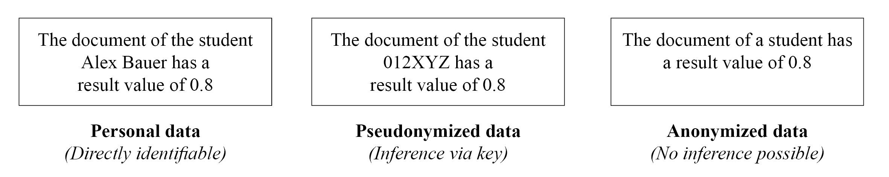

# bachelor-thesis-project
:warning: **Disclaimer**: *For privacy reasons, the source code and full written thesis are not publicly available. However, feel free to contact me if you'd like more details or a demonstration.*

## Introduction
This repository provides an overview of my **bachelor thesis project**, which focuses on the development of a **plagiarism-checking software prototype**. While the full implementation remains private, this documentation outlines the **core technologies**, **database schema**, and **real-time processing updates** using **Server-Sent Events (SSE)**. To give a better understanding of the system, I have also included **screenshots** showcasing the application's interface and key functionalities.

*Note: The legal analysis concerning General Data Protection Regulation (GDPR) compliance and pseudonymized document storage is not included in this repository. But below you can find a graphic illustrating the difference between personal, pseudonymized and anonymized data to illustrate the difference*

## Technical Documentation
The plagiarism checking software prototype follows a monolithic architecture for the core system, complemented by a small microservice for specialized calculations. This design ensures simplicity, maintainability, and allows for future scalability. The system consists of a frontend, backend, data storage, and a microservice component for computational tasks. Below is an overview of the key technologies used, along with a graphic for better visualization.

### Tech Stack
**Frontend** 
The client-side application is built using modern web technologies: 
- **Angular**: A TypeScript-based framework for building a dynamic and responsive user interface.
- **HTML5 & Tailwind CSS**: Used for structuring and styling the UI efficiently.
- **TypeScript**: Enhances maintainability with strong typing.

**Backend (Monolithic Core)** 
The backend follows a monolithic architecture implementation with the key components include: 
- **Java**: The primary programming language for backend development.
- **Spring Boot**: Simplifies development and deployment with pre-configured settings.
- **Spring Data JPA & Hibernate**: Handles database interactions in an object-oriented way.
- **Python Microservice**: A lightweight service responsible for performing plagiarism-checking and calculations.

 

**System Communication** 
- The frontend communicates with the backend via **REST API (JSON)**.
- **SSE** provides **real-time processing updates** from the backend to the frontend.
- The backend processes data and delegates specialized calculations to the Python microservice via **JSON-based requests**.
- SQL queries are executed between the backend and PostgreSQL database.
- Java File API is used for file storage and retrieval.

Plagiarism analysis can be time-consuming for large document collections, so the processing progress is transmitted to the web interface in real time. To implement this functionality, various technical mechanisms were explored, including polling, WebSockets, and Server-Sent Events (SSE), as illustrated in the communication diagram below. SSE proved to be the most efficient solution as it enables unidirectional communication where the server sends progress directly to the client without the client having to make repeated requests, saving resources and simplifying implementation.

### Data management: database schema and file system
The system uses PostgreSQL as a relational database to store structured data, including file metadata, user information, and role-based access control. However, documents are not stored directly in the database since relational databases are not optimized for large file storage. Instead, a dedicated file system manages document storage in an organized directory structure, while file paths and metadata are maintained in the database. This separation enhances performance and security, particularly in handling pseudonymized personal data, where sensitive information is managed through a separate mapping in the tables.

### Requirements
- Functional requirements
  - User authentication with **role-based access control**
  - Upload of assignment collections as **ZIP files containing PDFs**
  - **Real-time progress tracking** during plagiarism checking
  - **Results visualization** for analysis

- Non-functional requirements
  - **Scalability**: Designed for potential migration to a microservices architecture
  - **Usability**: Intuitive UI for seamless navigation
  - **Security**: Strong authentication and data protection measures
  - **Reliability**: Reliability of the system, including sufficient test coverage *(80%)*

## Application Showcase
This section provides a visual overview of the plagiarism-checking software prototype, highlighting key functionalities and user interface elements.

### User login and registration
Simple and intuitive GUI for login and registration.

&nbsp;&nbsp;&nbsp;

### Profile
The profile page provides an overview of previously processed exercise collections, displaying their status as either *PENDING* (under review) or *DONE* (completed). Users can track the progress percentage, view results, or delete collections. Additionally, new ZIP files can be uploaded via drag & drop or file selection trough the file browser of the corresponding OS.

### Results Overview
The results page displays the name and creation date of the uploaded archive along with the plagiarism analysis results. Each document is compared against others, generating a similarity score between 0 (no match) and 1 (identical match). The results are visually grouped into collapsible lists, categorized as critical, high, moderate, or low similarity, providing a clear overview.

### Media License
*All images, screenshots, and graphics in the **`media/`** folder are a copyright of the owner of this repository, [2025].
They are licensed under a [Creative Commons Attribution 4.0 International License (CC BY 4.0)](https://creativecommons.org/licenses/by/4.0/), meaning you can use, share, and adapt the media **as long as you provide appropriate credit** to this repository.
Please make sure to reference the repository as the source.*